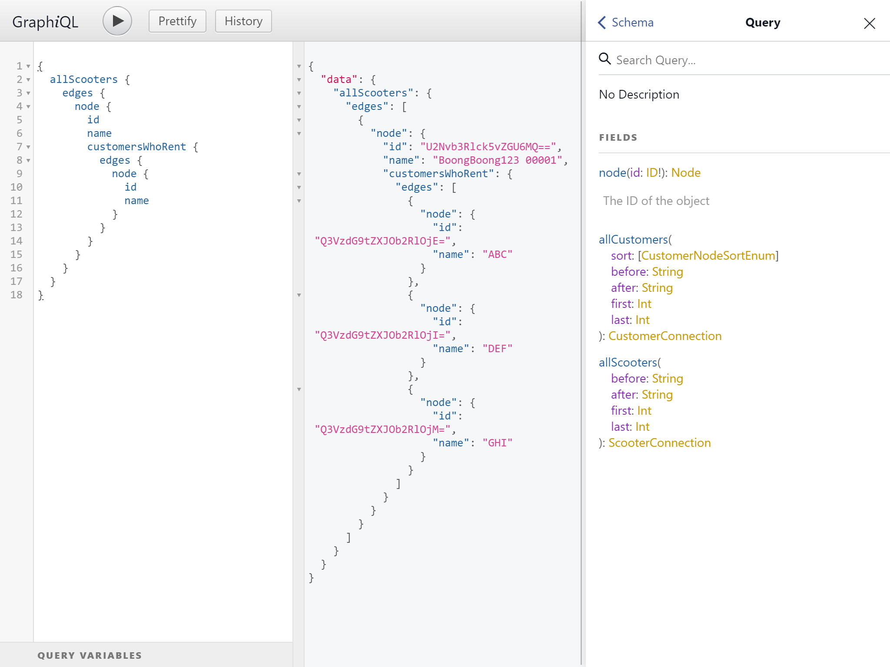

Try Graphene-SQLAlchemy
=======================

Trying `Graphene-SQLAlchemy Tutoral <http://docs.graphene-python.org/projects/sqlalchemy/en/latest/tutorial/>`__\ .

Installation
------------

Install requirements.

.. code:: bash

    pip install -r requirements.txt

Add some rows in database.

.. code:: pycon

    Python 3.7.5rc1 (default, Oct  8 2019, 16:47:45)
    [GCC 9.2.1 20190909] on linux
    Type "help", "copyright", "credits" or "license" for more information.
    >>> from src.models import Base, Customer, Scooter, db_session, engine
    >>> Base.metadata.create_all(bind=engine)
    >>> scooter = Scooter(name='BoongBoong123 00001')
    >>> customers = [Customer(name='ABC'), Customer(name='DEF'), Customer(name='GHI')]
    >>> scooter.customers_who_rent = customers
    >>> db_session.add(scooter)
    >>> db_session.commit()

Try
---

Run server.

.. code:: bash

    python run.py

And try some query on localhost:5000/graphql.

|Example Screenshot|

